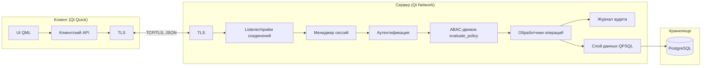
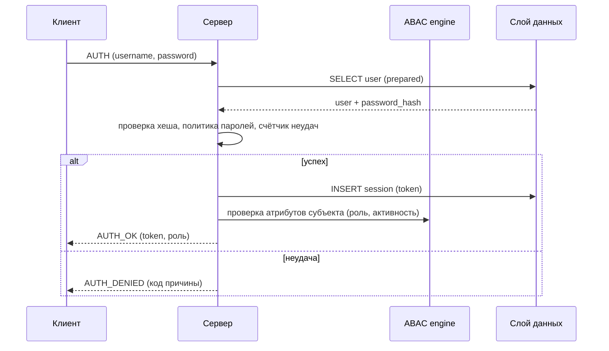
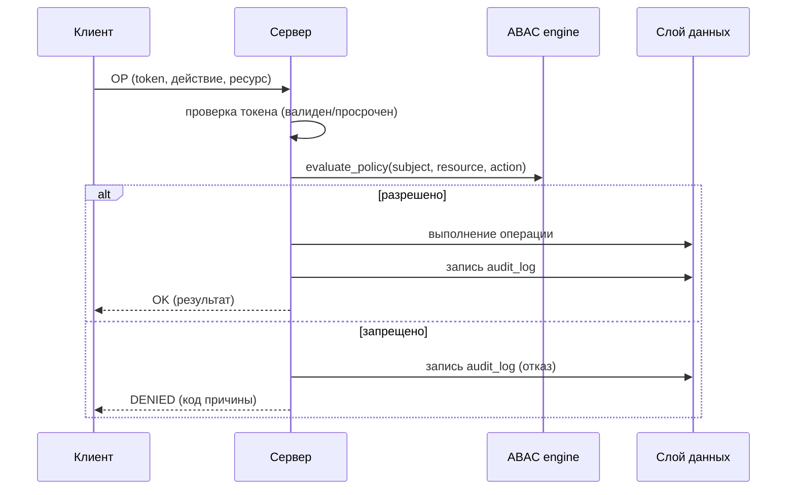

# Архитектура системы netaccess

Документ этапа «Эскизный проект» (ГОСТ 19.404-79, ГОСТ Р 59793-2021). Описывает
компоненты системы, их взаимодействие и потоки обработки запросов. Базируется на
ТЗ-НЕТАКЦЕСС-001 и модели угроз (раздел 6).

---

## 1 Общие принципы

1. Система имеет **клиент-серверную архитектуру**: тонкий клиент Qt Quick, сервер
   приложений Qt Network, СУБД PostgreSQL.
2. **Вся авторизация выполняется на сервере.** Клиент не принимает решений о доступе —
   это исключает обход проверки через модифицированный клиент.
3. **Проверка ABAC на каждый запрос.** Каждое действие с ресурсом (включая операции
   каталога, политик и аудита) проходит через ABAC-движок сервера.
4. **Deny by default.** Отсутствие разрешающего правила = отказ.
5. **Разделение ролей**: Администратор / Пользователь / Аудитор. Роль является атрибутом
   субъекта (модель ABAC), а не отдельным механизмом.
6. Канал защищён **TLS** (самоподписанный сертификат на этапе разработки/внедрения).
7. Данные — в PostgreSQL; доступ к БД — только со стороны сервера через сервисную
   учётную запись с минимальными привилегиями.

## 2 Диаграмма компонентов

## 3 Модульная структура

### 3.1 Сервер

| Модуль | Назначение |
|---|---|
| `server_main` | Точка входа: чтение конфигурации, запуск listener, подключение к БД |
| `listener` | Приём TCP-соединений, TLS-хендшейк |
| `session_manager` | Учёт сессий (токены), таймауты, максимальное число сессий |
| `authenticator` | Проверка учётных данных, генерация токена, политика паролей, блокировка |
| `policy_engine` | ABAC: `evaluate_policy(subject, resource, action)`, типизированные условия политик (роль, подразделение, уровень допуска, тип ресурса, конкретный субъект/ресурс) |
| `handlers` | Обработчики операций (каталог ресурсов, политики, аудит, пользователи) |
| `audit` | Запись событий безопасности в `audit_log` (ГОСТ Р 59548) |
| `db_layer` | Слой данных: параметризованные запросы QPSQL (prepared statements) |

### 3.2 Клиент

| Модуль | Назначение |
|---|---|
| `client_main` | Точка входа, запуск QML-окружения |
| `api_client` | Сетевой клиент: установка соединения, отправка/приём сообщений, TLS |
| `session_state` | Хранение токена и сведений о текущем пользователе |
| `QML-страницы` | Экран входа, каталог ресурсов, управление правами, журнал аудита |

### 3.3 Общая библиотека (`src/common`)

| Модуль | Назначение |
|---|---|
| `domain` | Модель данных ABAC: Subject, Resource, Policy, Action, evaluate_policy |
| `protocol` | Сериализация/десериализация сообщений (JSON), коды операций и результатов |

## 4 Потоки обработки

### 4.1 Аутентификация

### 4.2 Проверка доступа (на каждую операцию)

### 4.3 Журнал аудита

Каждое событие безопасности записывается в `audit_log`:
вход/выход, успешные и неудачные попытки доступа, изменение прав, управление
пользователями и ресурсами, изменение политик. Записи не редактируются и не
удаляются штатными средствами клиента; просмотр доступен ролям Администратор и
Аудитор (ГОСТ Р 59548-2022).

## 5 Обработка ошибок и отказоустойчивость

1. Ошибочный/некорректный JSON-запрос → ответ `ERROR` с кодом, сервер продолжает работу.
2. Разрыв соединения клиента → сессия остаётся в БД до истечения таймаута.
3. Потеря связи с PostgreSQL → сервер логирует и повторяет подключение с экспоненциальной
   задержкой; клиентам возвращается `ERROR_SERVER_BUSY`.
4. Повторная попытка подключения клиента — штатная (клиент реконнектит с задержкой).
5. Таймауты: ожидание полезной нагрузки (заголовок) ≤ 30 с, срок жизни токена сессии —
   8 часов, неактивная сессия — 30 минут.

## 6 Конфигурация сервера

| Параметр | Назначение | По умолчанию |
|---|---|---|
| `listen_host` | адрес прослушивания | 0.0.0.0 |
| `listen_port` | порт | 0.0.0.0: 9988 |
| `tls_cert` / `tls_key` | самоподписанный сертификат | `certs/server.crt` |
| `db_host`, `db_port`, `db_name`, `db_user`, `db_password` | подключение к PostgreSQL | localhost:5432, netaccess |
| `session_lifetime_h` | срок жизни токена | 8 |
| `max_sessions` | максимум одновременных сессий | 100 |

## 7 Кроссплатформенность и сборка

- C++20, Qt 6.8 (Core, Network, Sql, Qml, Quick), PostgreSQL, QPSQL.
- CMake ≥ 3.31, Conan 2, Ninja; CI: Windows (MSVC) + Ubuntu (GCC).
- Единая кодовая база сервера и клиента; QML-интерфейс.
- Локализация RU/EN через Qt Linguist (`.ts`/`.qm`).

## 8 Соответствие требованиям ИБ (из модели угроз)

| Угроза | Архитектурное решение |
|---|---|
| У1, У5 (НСД к БД) | доступ к БД только через сервер; сервисная учётная запись без суперпривилегий |
| У2, У19 (подбор) | блокировка после 5 неудач; политика паролей; счётчик в БД |
| У4 (эскалация) | авторизация ABAC на каждый запрос; роль — атрибут |
| У6, У15 (перехват/MITM) | TLS; самоподписанный сертификат с фиксацией отпечатка на клиенте |
| У7, У11 (целостность журнала) | `audit_log` append-only; просмотр только Аудитор/Администратор |
| У12 (SQL-инъекции) | prepared statements во всех запросах |
| У13 (уязвимости C++) | SAST (clang-tidy/CodeQL), санитайзеры в Debug |
| У14 (malformed-пакеты) | строгая валидация JSON-схемы каждого сообщения |
| У18–У20 (LLM-угрозы) | минимальные привилегии (ABAC), мониторинг (аудит), human oversight |
