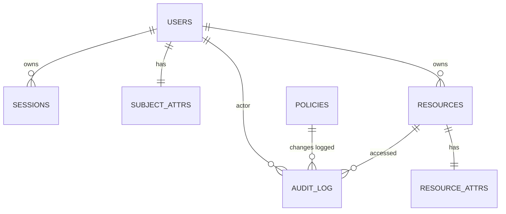

# Проектирование базы данных netaccess

Документ этапа «Технический проект» (ГОСТ 19.401-78, ГОСТ 19.404-79). Описывает
логическую и физическую модель БД PostgreSQL. SQL-скрипты создания — в Приложение 3 ВКР
и `src/server/sql/schema.sql` при реализации.

---

## 1 Требования и допущения

1. СУБД — PostgreSQL 13–17.
2. Доступ к БД — только со стороны сервера через сервисную учётную запись
   (не суперпользователь; ограничены DDL-привилегии на время применения схемы).
3. Все запросы — параметризованные (prepared statements) — защита от SQL-инъекций (У12).
4. Журнал аудита — append-only; модификация/удаление записей запрещена ролями БД.
5. Хранение паролей — только хеши (PBKDF2-HMAC-SHA256), никогда — открытым текстом.
6. Политика доступа ABAC: решение принимает сервер; БД хранит атрибуты субъектов,
   атрибуты ресурсов и правила политик.

## 2 ER-диаграмма



## 3 Логическая модель

### 3.1 Справочник действий (action)

Множество действий, определяющих права: `read`, `write`, `manage`, `connect`,
`select`, `modify`, `print`, `access`, `admin`. Хранится в коде как перечисление
и в БД как текстовые коды (без отдельной таблицы; целостность — через CHECK/ENUM).

### 3.2 Сущности

| Сущность | Ключ | Описание |
|---|---|---|
| `users` | id | Учётные записи сотрудников |
| `sessions` | id | Активные сессии (токены) |
| `subject_attrs` | user_id | Атрибуты субъекта ABAC (роль, уровень допуска, подразделение) |
| `resources` | id | Каталог сетевых ресурсов |
| `resource_attrs` | resource_id | Атрибуты ресурса ABAC (тип) |
| `policies` | id | Правила доступа ABAC (условие → разрешённое действие) |
| `audit_log` | id | Журнал аудита (append-only) |

## 4 Физическая модель (PostgreSQL)

### 4.1 Пользователи

```sql
CREATE TABLE users (
    id              BIGSERIAL PRIMARY KEY,
    username        TEXT NOT NULL UNIQUE CHECK (length(username) BETWEEN 3 AND 64),
    password_hash   TEXT NOT NULL,                -- PBKDF2-HMAC-SHA256
    salt            TEXT NOT NULL,
    full_name       TEXT NOT NULL CHECK (length(full_name) <= 200),
    position        TEXT,                          -- должность
    is_active       BOOLEAN NOT NULL DEFAULT TRUE,
    created_at      TIMESTAMPTZ NOT NULL DEFAULT now(),
    updated_at      TIMESTAMPTZ NOT NULL DEFAULT now(),
    last_login_at   TIMESTAMPTZ,
    failed_attempts INT NOT NULL DEFAULT 0,        -- блокировка после 5
    locked_until    TIMESTAMPTZ                    -- срок блокировки (15 мин)
);
CREATE INDEX idx_users_username ON users (username);
```

### 4.2 Атрибуты субъекта (ABAC)

```sql
CREATE TABLE subject_attrs (
    user_id           BIGINT PRIMARY KEY REFERENCES users(id) ON DELETE CASCADE,
    role              TEXT NOT NULL DEFAULT 'user'    -- admin | user | auditor
                      CHECK (role IN ('admin', 'user', 'auditor')),
    clearance_level   INT  NOT NULL DEFAULT 0 CHECK (clearance_level BETWEEN 0 AND 5),
    department        TEXT                            -- подразделение
);
```

### 4.3 Сессии

```sql
CREATE TABLE sessions (
    id          BIGSERIAL PRIMARY KEY,
    user_id     BIGINT NOT NULL REFERENCES users(id) ON DELETE CASCADE,
    token_hash  TEXT NOT NULL UNIQUE,               -- хеш токена (не сам токен)
    created_at  TIMESTAMPTZ NOT NULL DEFAULT now(),
    expires_at  TIMESTAMPTZ NOT NULL,
    revoked_at  TIMESTAMPTZ
);
CREATE INDEX idx_sessions_user ON sessions (user_id);
CREATE INDEX idx_sessions_expires ON sessions (expires_at);
```

### 4.4 Ресурсы и атрибуты ресурса

```sql
CREATE TABLE resources (
    id          BIGSERIAL PRIMARY KEY,
    name        TEXT NOT NULL CHECK (length(name) BETWEEN 1 AND 200),
    description TEXT,
    resource_type TEXT NOT NULL
                 CHECK (resource_type IN ('file_share','database','printer','web_service','server','vpn')),
    address     TEXT,                                -- сетевой адрес/путь
    owner_id    BIGINT REFERENCES users(id) ON DELETE SET NULL,  -- владелец
    is_active   BOOLEAN NOT NULL DEFAULT TRUE,
    created_at  TIMESTAMPTZ NOT NULL DEFAULT now(),
    updated_at  TIMESTAMPTZ NOT NULL DEFAULT now()
);
CREATE INDEX idx_resources_type ON resources (resource_type);
```

### 4.5 Политики доступа (ABAC)

Правило: при совпадении условий (атрибуты субъекта и/или ресурса) разрешить действие.
Условия — типизированные nullable-колонки; допустимые значения контролируются
ограничениями CHECK.

```sql
CREATE TABLE policies (
    id                  BIGSERIAL PRIMARY KEY,
    name                TEXT NOT NULL UNIQUE CHECK (length(name) <= 200),
    enabled             BOOLEAN NOT NULL DEFAULT TRUE,
    action              TEXT NOT NULL
                        CHECK (action IN ('read','write','manage','connect','select','modify','print','access','admin','*')),
    role_required       TEXT CHECK (role_required IN ('admin','user','auditor')),
    department_required TEXT,
    min_clearance       INT  CHECK (min_clearance BETWEEN 0 AND 5),
    resource_type       TEXT CHECK (resource_type IN ('file_share','database','printer','web_service','server','vpn')),
    subject_id          BIGINT REFERENCES users(id) ON DELETE SET NULL,   -- конкретный субъект (GRANT_ACCESS)
    resource_id         BIGINT REFERENCES resources(id) ON DELETE SET NULL, -- конкретный ресурс (GRANT_ACCESS)
    priority            INT NOT NULL DEFAULT 0,       -- чем больше, тем приоритетнее
    created_by          BIGINT REFERENCES users(id) ON DELETE SET NULL,
    created_at          TIMESTAMPTZ NOT NULL DEFAULT now(),
    updated_at          TIMESTAMPTZ NOT NULL DEFAULT now()
);
CREATE INDEX idx_policies_enabled ON policies (enabled, priority);
```

**Семантика.** При проверке доступа сервер собирает все включённые политики,
у которых условие по субъекту и ресурсу выполняется, выбирает с максимальным
`priority`; при отсутствии политики — **отказ** (deny by default).

### 4.6 Журнал аудита (append-only)

```sql
CREATE TABLE audit_log (
    id          BIGSERIAL PRIMARY KEY,
    ts          TIMESTAMPTZ NOT NULL DEFAULT now(),
    actor_id    BIGINT REFERENCES users(id) ON DELETE SET NULL,
    actor_name  TEXT,                                -- снимок имени (не JOIN)
    action      TEXT NOT NULL,                       -- AUTH_SUCCESS, AUTH_FAILURE,
                                                    -- ACCESS_GRANTED, ACCESS_DENIED,
                                                    -- POLICY_CHANGE, RESOURCE_*, USER_*, SESSION_*
    target_type TEXT,                                -- resource | policy | user | session | system
    target_id   BIGINT,
    result      TEXT NOT NULL,                       -- ok | denied | error
    details     JSONB                               -- доп. контекст (IP, причина, значения)
);
CREATE INDEX idx_audit_ts ON audit_log (ts DESC);
CREATE INDEX idx_audit_actor ON audit_log (actor_id);
CREATE INDEX idx_audit_action ON audit_log (action);

-- Защита журнала: запретить UPDATE и DELETE всем ролям БД
REVOKE UPDATE, DELETE ON audit_log FROM PUBLIC;
```

## 5 Ограничения и нормализация

1. Модель находится в **третьей нормальной форме (3НФ)**: каждая неключевая
   зависимость — только от первичного ключа.
2. Повторяющиеся значения `role`, `resource_type`, `action` вынесены в CHECK-ограничения
   (домены); выделение справочных таблиц не требуется при фиксированном наборе.
3. Условия политик — **типизированные nullable-колонки**; набор условий фиксирован
   моделью ABAC (роль, подразделение, уровень допуска, тип ресурса, конкретный
   субъект/ресурс). Расширение набора атрибутов выполняется версионированными
   миграциями схемы.
4. Журнал аудита намеренно **не нормализуется** (снимки `actor_name`, `details`)
   — исторические данные не должны меняться при изменении связанных сущностей.

## 6 Безопасность данных (из модели угроз)

| Угроза | Мера в БД |
|---|---|
| У5 (прямой доступ к БД) | сервисная роль без UPDATE/DELETE на audit_log, без TRUNCATE; пароль — в файле конфигурации с правами 0600 |
| У12 (SQL-инъекции) | prepared statements; данные пользователя никогда не конкатенируются в SQL |
| У2 (подбор пароля) | `failed_attempts`, `locked_until` на уровне БД + проверка на сервере |
| У3 (сохранённые права) | деактивация `users.is_active = FALSE` немедленно отзывает доступ (сервер проверяет на каждый запрос) |
| У7 (искажение политик) | `policies` изменяется только ролями admin; изменения фиксируются в `audit_log` |
| У11 (подмена журнала) | REVOKE UPDATE/DELETE; отдельная роль для записи; мониторинг целостности |
| У8, У10 (целостность, утрата) | транзакции; резервное копирование `pg_dump` ежесуточно; `updated_at`-триггеры |

## 7 Миграции

Схема управляется версионированными скриптами (`src/server/sql/V001__schema.sql`,
`V002__seed.sql`). Применение — при запуске сервера (идентично по структуре
инструментам Flyway/Liquibase, но без внешних зависимостей).

`V002__seed.sql` загружает:
- администратора (учётная запись + `subject_attrs.role = 'admin'`);
- **базовые политики** доступа по умолчанию, задающие стандартные права ролей
  на классы ресурсов (например, `user` → `read`/`write` на `file_share`,
  `connect`/`select`/`modify` на `database`, `print` на `printer`, `access` на
  `web_service`; `auditor` → `read` на `audit_log`; `admin` → `admin` на все типы).
  Базовые политики имеют низкий приоритет и перекрываются конкретными правилами
  `GRANT_ACCESS` (`subject_id`/`resource_id`), а отзыв права — отключение/удаление
  политики.
