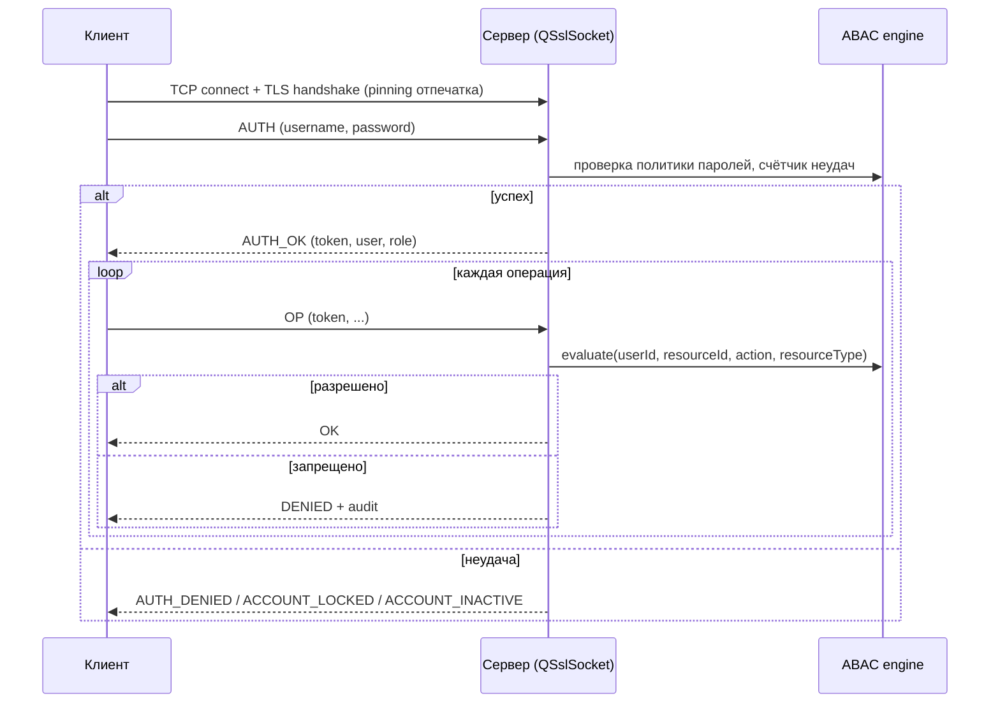

# Протокол взаимодействия клиента и сервера netaccess

Документ этапа «Технический проект» (ГОСТ 19.404-79). Определяет формат сообщений,
коды операций и результатов, порядок сеанса аутентификации и передачи данных между
клиентом и сервером. Транспорт — TCP, защита — TLS, кодирование — JSON.

---

## 1 Общие положения

1. Транспорт: TCP (соединение устанавливает клиент к серверу).
2. Защита: TLS 1.3 (Qt `QSslSocket`); самоподписанный сертификат сервера; клиент
   проверяет отпечаток сертификата (pinning) — защита от MITM (У15).
3. Кодирование сообщений: UTF-8 JSON.
4. Формат: каждый запрос/ответ — одно JSON-сообщение, дополненное 4-байтовым
   префиксом длины полезной нагрузки (network byte order) для фрейминга.
5. Версия протокола: `1`.
6. Принцип: **все решения об авторизации принимает сервер**; клиент не интерпретирует
   права самостоятельно.

## 2 Формат сообщения

```
+----------------+-----------------------------+
| length (u32 BE) | payload (length байт, JSON) |
+----------------+-----------------------------+
```

### 2.1 Запрос (клиент → сервер)

```json
{
  "version": 1,
  "op": "<операция>",
  "req_id": 42,
  "token": "<токен сессии, кроме AUTH>",
  "data": { ... }
}
```

### 2.2 Ответ (сервер → клиент)

```json
{
  "version": 1,
  "op": "<та же операция>",
  "req_id": 42,
  "status": "ok" | "denied" | "error",
  "code": "<код>",
  "message": "человекочитаемое пояснение",
  "data": { ... }
}
```

## 3 Коды операций (`op`)

| Код | Назначение | Требуемая роль |
|---|---|---|
| `AUTH` | Аутентификация, получение токена | — (без токена) |
| `LOGOUT` | Завершение сессии | любой |
| `ME` | Сведения о текущем пользователе и его атрибутах | любой |
| `RESOURCE_LIST` | Список ресурсов (с фильтрами) | user, admin, auditor |
| `RESOURCE_GET` | Карточка ресурса | user, admin, auditor |
| `RESOURCE_CREATE` | Добавление ресурса в каталог | admin |
| `RESOURCE_UPDATE` | Изменение ресурса | admin |
| `RESOURCE_DELETE` | Удаление ресурса | admin |
| `POLICY_LIST` | Список политик ABAC | admin, auditor |
| `POLICY_CREATE` / `POLICY_UPDATE` / `POLICY_DELETE` | Управление политиками | admin |
| `USER_LIST` / `USER_CREATE` / `USER_UPDATE` / `USER_DELETE` | Управление пользователями | admin |
| `ACCESS_CHECK` | Проверка доступа к ресурсу (тестовая) | user, admin |
| `GRANT_ACCESS` | Выдача права (создание/включение правила) | admin |
| `REVOKE_ACCESS` | Отзыв права | admin |
| `AUDIT_QUERY` | Выборка из журнала аудита | auditor, admin |

## 4 Коды результатов (`code`)

| Код | Описание |
|---|---|
| `OK` | успех |
| `AUTH_DENIED` | неверные учётные данные |
| `AUTH_FAILED_TOO_MANY` | учётная запись заблокирована (5 неудач) |
| `ACCOUNT_LOCKED` | заблокирована до `locked_until` |
| `ACCOUNT_INACTIVE` | учётная запись деактивирована |
| `TOKEN_INVALID` / `TOKEN_EXPIRED` | токен невалиден/просрочен |
| `ACCESS_DENIED` | нет прав на операцию (ABAC) |
| `RESOURCE_NOT_FOUND` | ресурс отсутствует |
| `VALIDATION_ERROR` | неверная схема JSON-запроса |
| `UNSUPPORTED_OP` | неизвестная операция |
| `SERVER_BUSY` | сервер временно недоступен (БД) |
| `INTERNAL_ERROR` | внутренняя ошибка |

## 5 Операции — детально

### 5.1 `AUTH`

Запрос:
```json
{
  "op": "AUTH", "req_id": 1,
  "data": { "username": "ivanov", "password": "*****" }
}
```

Ответ (успех):
```json
{
  "op": "AUTH", "req_id": 1, "status": "ok", "code": "OK",
  "data": {
    "token": "<случайный 256-битный токен>",
    "expires_at": "2026-08-15T20:00:00Z",
    "user": {
      "id": 7, "username": "ivanov", "full_name": "Иванов И. И.",
      "role": "admin", "clearance_level": 5
    }
  }
}
```

Сервер:
- хеширует пароль (PBKDF2-HMAC-SHA256) и сверяет с БД;
- при неудаче инкрементирует `failed_attempts`; при 5 → блокировка на 15 минут;
- при успехе сбрасывает счётчик, записывает `last_login_at`, создаёт запись в `sessions`
  (в БД хранится **хеш токена**, не сам токен) и в `audit_log` (AUTH_SUCCESS/AUTH_FAILURE).

### 5.2 `RESOURCE_LIST`

```json
{
  "op": "RESOURCE_LIST", "req_id": 2, "token": "...",
  "data": { "resource_type": "database", "page": 1, "page_size": 50 }
}
```

Ответ: `data: { "items": [ ... ], "total": 12 }`. Пользователь видит только те ресурсы,
на которые у него есть разрешённое действие (ABAC); администратор и аудитор — все
(администратор — с правом изменения, аудитор — только чтение).

### 5.3 `ACCESS_CHECK`

Проверка доступа субъекта к ресурсу с указанным действием (без реального выполнения).
```json
{
  "op": "ACCESS_CHECK", "req_id": 3, "token": "...",
  "data": { "resource_id": 10, "action": "write" }
}
```
Ответ: `status: "ok"` / `status: "denied"`, `code: "ACCESS_DENIED"`. Используется
клиентом для отображения доступных действий и тестами безопасности.

### 5.4 `AUDIT_QUERY`

```json
{
  "op": "AUDIT_QUERY", "req_id": 4, "token": "...",
  "data": {
    "from": "2026-08-01T00:00:00Z", "to": "2026-08-15T23:59:59Z",
    "actor_id": 7, "action": "ACCESS_DENIED", "page": 1, "page_size": 100
  }
}
```
Ответ: `data: { "items": [...], "total": N }`. Доступен только ролям `auditor` и `admin`.

### 5.5 `GRANT_ACCESS` / `REVOKE_ACCESS`

Выдача права реализуется **созданием правила политики** (чистая модель ABAC):
политика с условиями на конкретного субъекта и/или ресурс и указанным действием.
Запрос:
```json
{
  "op": "GRANT_ACCESS", "req_id": 5, "token": "...",
  "data": {
    "subject_id": 7, "resource_id": 10, "action": "write",
    "ttl_days": 30
  }
}
```
Операция требует роли `admin`; каждое изменение фиксируется в `audit_log`
(`POLICY_CHANGE`). Включение срока действия (`ttl_days`) позволяет автоматически
отзывать временный доступ — мера против угрозы У3 (сохранение прав). `REVOKE_ACCESS`
отключает/удаляет соответствующее правило политики.

### 5.6 `POLICY_CREATE` / `POLICY_UPDATE`

Создание/изменение правила политики ABAC с типизированными условиями:
```json
{
  "op": "POLICY_CREATE", "req_id": 6, "token": "...",
  "data": {
    "name": "allow-db-select-it",
    "action": "select",
    "priority": 10,
    "role_required": "user",
    "department_required": "IT",
    "min_clearance": null,
    "resource_type": "database",
    "subject_id": null,
    "resource_id": null
  }
}
```
Поля условий (`role_required`, `department_required`, `min_clearance`,
`resource_type`, `subject_id`, `resource_id`) необязательны: `null` означает
«условие не задано». Допустимые значения совпадают с ограничениями БД
(см. `docs/database.md`). Управление политиками доступно роли `admin`.

## 6 Сеанс аутентификации



## 7 Обработка ошибок

1. Некорректный JSON или неполный фрейм → `VALIDATION_ERROR`, соединение продолжает работу.
2. Неизвестная `op` → `UNSUPPORTED_OP`.
3. Токен отсутствует/невалиден/просрочен → `TOKEN_INVALID`/`TOKEN_EXPIRED`; клиент
   должен повторно выполнить `AUTH`.
4. Ошибка БД → `SERVER_BUSY` или `INTERNAL_ERROR`; сервер не завершает работу.
5. Превышение лимита размера сообщения (защита от malformed-пакетов, У14):
   максимальная длина полезной нагрузки — 16 МБ; превышение → `VALIDATION_ERROR`
   и закрытие соединения.

## 8 Версионирование и обратная совместимость

1. Поле `version` обязательно в каждом сообщении.
2. При несовпадении версии сервер отвечает `UNSUPPORTED_OP` с поддерживаемыми версиями.
3. Добавление новых полей в `data` — обратно совместимо (игнорируются неизвестные поля);
   удаление/переименование полей — мажорная смена версии протокола.
